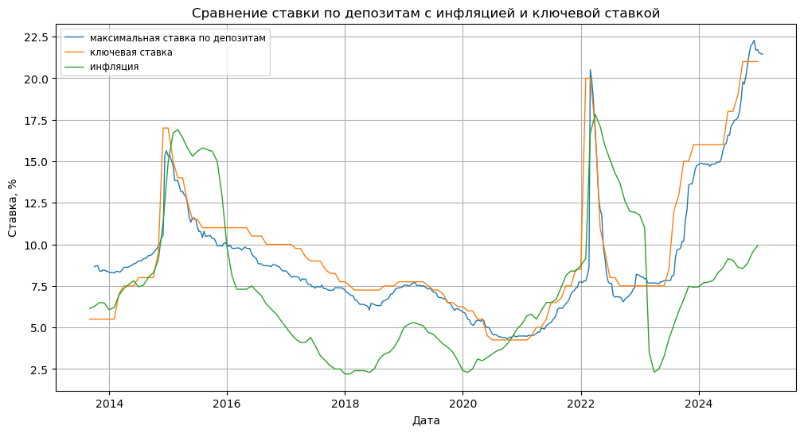
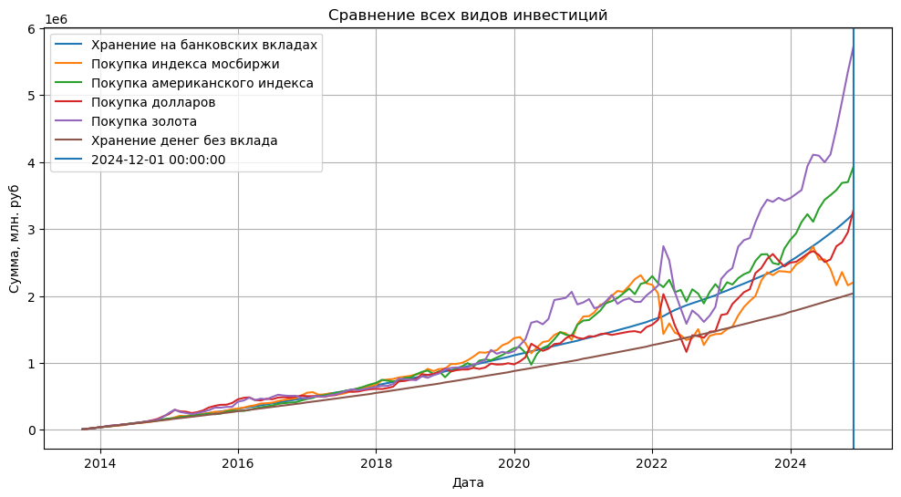

# russian_investment_simulation
 Основной идеей было сравнить историческую доходность при инвестициях в различные активы, доступные среднестатистическому россиянину. Будем считать для обычного человека, который откладывает для инвестиций 30% своей зарплаты. Данные для зарплаты возьмём с [сайта росстата](https://rosstat.gov.ru/labor_market_employment_salaries), динамику максимальной процентной ставки по вкладам возьмём с [сайта ЦБ](https://www.cbr.ru/statistics/avgprocstav/). Будут рассмотрены следующие варианты:
- Вклад в банке (будем считать что каждый раз создаётся вклад на 1 месяц)
- Покупка индекса мосбиржи на все средства
- Покупка долларов и покупка индекса S&P500 на все доступные средства
- Покупка долларов и хранение без вклада
- Покупка золота

## Запуск и изменения

Для моделирования используются только пакеты pandas, numpy и matplotlib языка python. Весь код находится в файле main.ipynb

## Сравнение ставки по вкладам, ключевой ставки и официальной инфляции

Сравним ставки по вкладам с инфляцией и ключевой ставкой.  

  

## Сравнение всех видов инвестиций

  

## Данные
- [Данные по максимальной процентной ставке для вкладов](https://www.cbr.ru/statistics/avgprocstav/)
- [Данные по индексу мосбиржи](https://www.moex.com/ru/index/IMOEX)
- [Данные по курсу доллара](https://ru.investing.com/currencies/usd-rub)
- [Данные по курсу spy ETF (ETF, повторяющий индекс S&P500)](https://ru.investing.com/etfs/spdr-s-p-500)
- [Данные по цене на золото](https://www.cbr.ru/hd_base/metall/metall_base_new/)
- [Данные по зарплатам](https://rosstat.gov.ru/labor_market_employment_salaries)
- [Данные по инфляции и ключевой ставке](https://www.cbr.ru/hd_base/infl/)